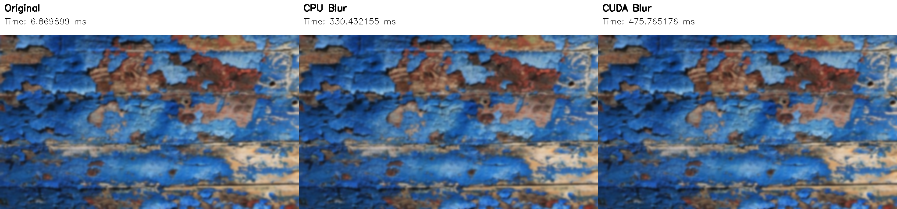

# CUDA Image Processing Project (Title TBD)

This repository contains a small project for running CUDA code that performs an image processing task (inference/transform/analysis). The intent is to provide a simple, GPU-accelerated pipeline for experimenting with CUDA kernels and image IO.

Note: this project is intended to be run inside a VS Code dev container — in my setup I'm using WSL 2 with a VS Code dev container.

The Dockerfile and devcontainer.json are set up to provide a consistent environment with the necessary CUDA toolkit and libraries. VSCode _should_ install the things you need.

NOTE: This project is a work in progress and may actually Not Be Good :TM:

## Getting started

Prerequisites:
- NVIDIA GPU with a supported driver
- CUDA Toolkit installed
- CMake and a C/C++ compiler

Build (typical):
```bash
./build_project.sh
# or manually:
cmake -S . -B build
cd build
make
```

## Project layout (expected)
- src/         — CUDA and host-side source files
- include/     — headers
- images/      — sample images for testing
- CMakeLists.txt

## Notes
- Check src/ and CMakeLists.txt for exact build and run targets.
- Ensure the CUDA toolkit version matches the project's requirements.
- This project imports a whole bunch of OpenGL and glfw3 stuff, but it's not actually used in the current code. It may be useful for future extensions involving rendering.

License: see LICENSE (if present).

## Changelog:

### 11-14-2025 
  #### I got a basic skeleton working for:
  1. Loading an image from disk
  2. Running a Gaussian blur on the image using both CPU and CUDA implementations
      - I am actually using a separable Gaussian blur for better performance, this means two passes: horizontal and vertical
  3. Saving the output images back to disk

  But the CUDA implementation is actually being slow for the test input, compared to my CPU. I need to figure out how to profile and optimize it better.

  The "control" method is from OpenCV's built-in Gaussian blur function, which is highly optimized. Here's a comparison of the results:
  